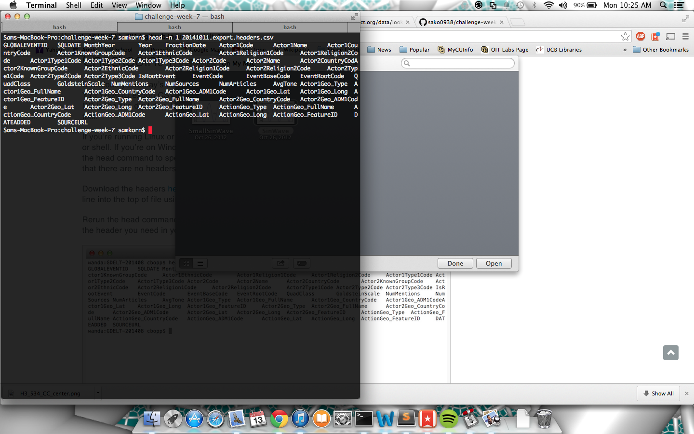
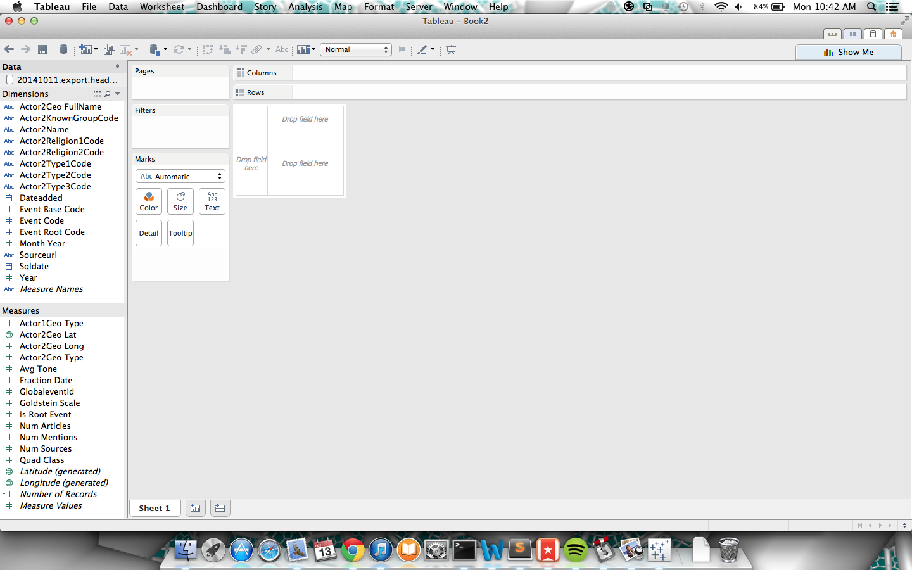
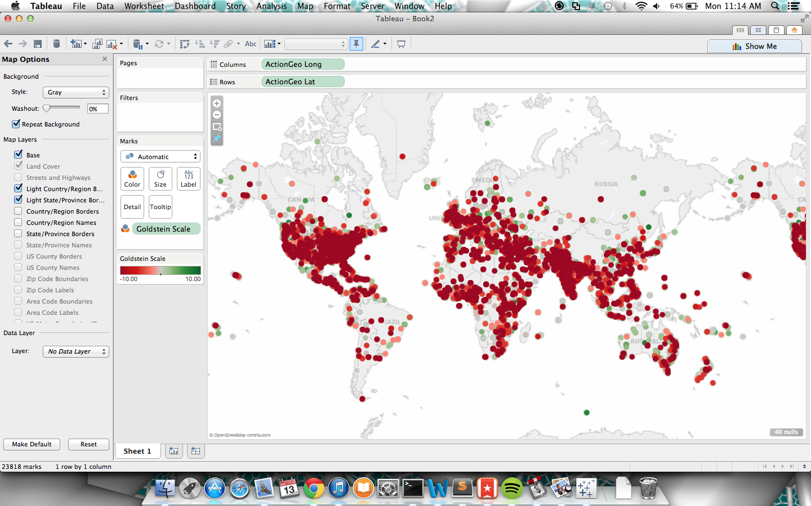
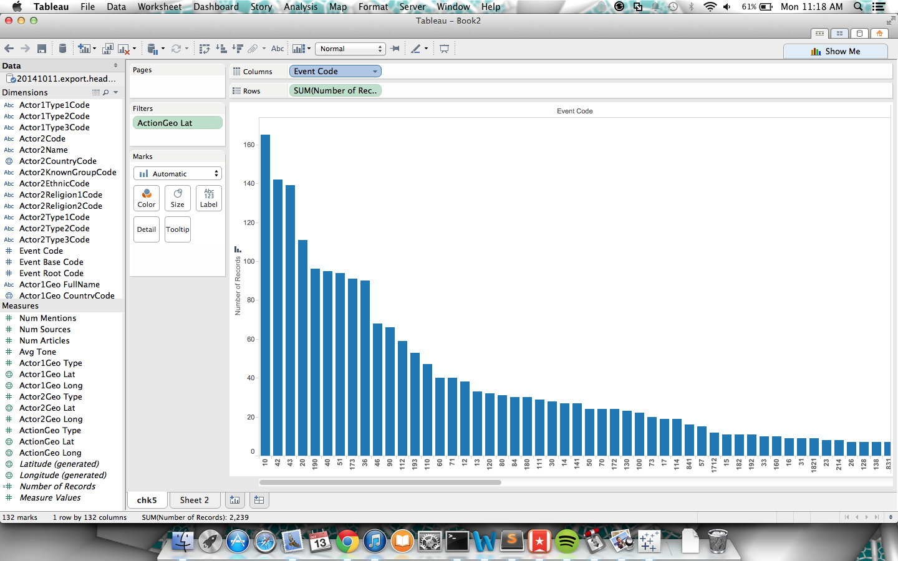
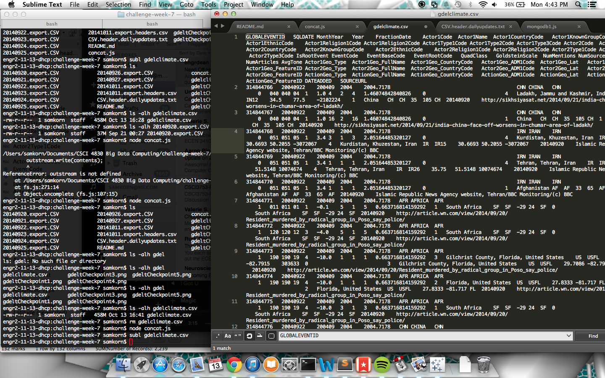

# Name
Sam Korn

# How many points have you earned?

100/100

(Make your own calculation and replace the number 0 with the points you think you've earned.)

# How many hours have you spent on this?

4

# What is the most difficult part about this week's challenge?

The javascript concatenation of files.

# Show and tell (10 points)

## Link (2 points)

[How Big Data is Going to help feed 9 billion by 2050](http://www.techrepublic.com/article/how-big-data-is-going-to-help-feed-9-billion-people-by-2050/)

## Explain why you found the project interesting. (8 points)

This article is interesting because it talks about how an archaic industry is just starting to modernize to current technology. It will help fix glaring inefficiencies in growing food.

# GDELT (I) (5 points x 6 + 20 points x 3 = 90 points)

## Checkpoints

### 1 (5 points)

### 2 What types of questions do you think this database could provide insight into? (5 points)

The cause and effect of economic and war events.
Whether or not certain religious group have an effect on the economic stability of a country.

### 3 (5 points)

### 4 (5 points)

### 5a (5 points)

### 5b Do you have any thoughts on why these events are missing geographic information? (5 points)
Event codes with no Latitude Data:
10: DEMAND
042: Make a visit
043: Host a visit
20: USE UNCONVENTIONAL MASS VIOLENCE
190: Use conventional military force, not specified below

These events may not have geographic information in the lat/long fields because they pertain to more general locations than an exact latitude and longitude like a country or region.

## Challenges

### 1 (20 points)
These event codes from the gdelt project are ones that can be looked at more closely to see an impact of the protests:
083	Accede to requests or demands for political reform not specified below
1042	Demand policy change
102	Demand policy support
03	EXPRESS INTENT TO COOPERATE
014	Consider policy option
141	Demonstrate or rally
Using Tableau, make a graph similar to checkpoint 5, where there is instead a filter for the event codes above. We can color these event codes based on whether it is an event caused by the general public(a demand) vs an event created by leadership(a response). Using this it should be able to tell whether or not the leadership responded positively to the protests.

### 2 (20 points)

### 3 (20 points)

The biggest number of events during the week timespan of September 20-September 27 was event codes 14 and 141. Event 14 was consider policy option and 141 was a demonstration or a rally. In the 141 bar, earlier in the week the bar is thicker, which probably correllates to the rallys happening outside of the UN. Later on in the week the 14 bar gets slightly longer on average, which might mean around the world leaders were beginning to start considering new policies on the environment. This data supports the idea that the rally had an effect on policy around the world.	
