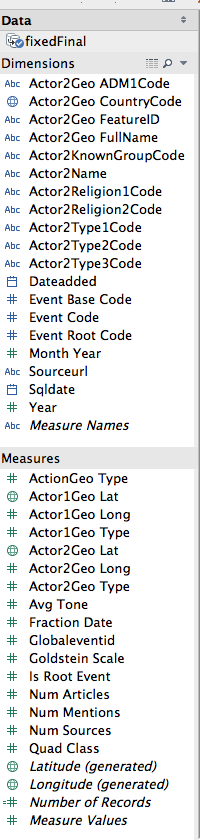
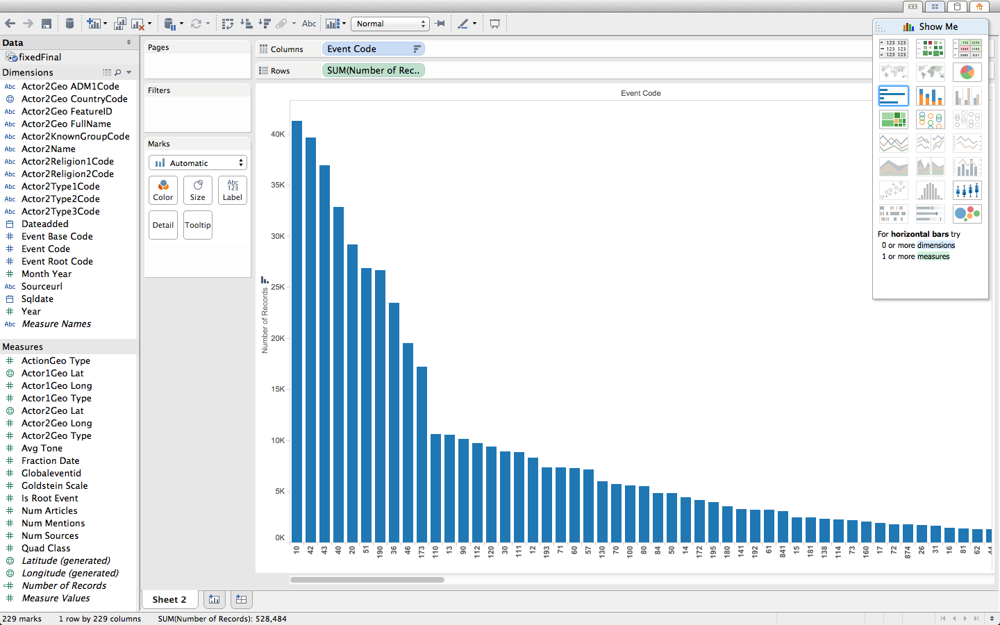
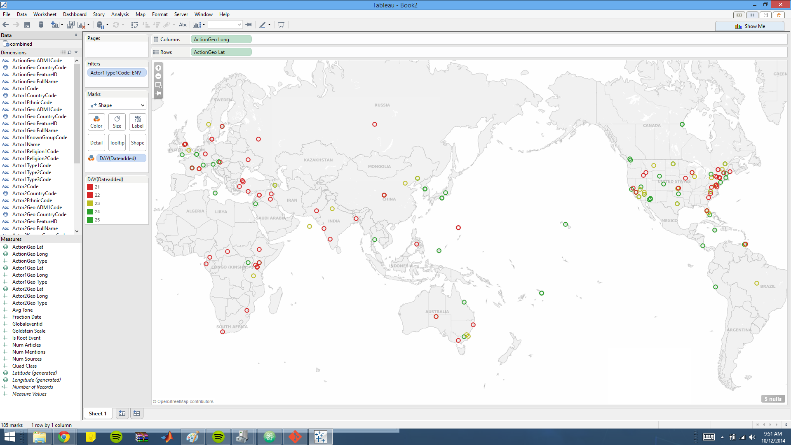

# Name

Alex Tsankov

# How many points have you earned?

100/100

(Make your own calculation and replace the number 0 with the points you think you've earned.)

# How many hours have you spent on this?

2.5

# What is the most difficult part about this week's challenge?

Getting the headers into the CSV file. 

# Show and tell (10 points)

## Link (2 points)

[Using Big Data For Social Good](http://www.forbes.com/sites/ashoka/2014/08/27/using-big-data-for-social-good/)

## Explain why you found the project interesting. (8 points)

I think the idea of using actual data to predict whether philanthropic organizations will be effective might be useful for encouraging potential donors. 

# GDELT (I) (5 points x 6 + 20 points x 3 = 90 points)

## Checkpoints

### 1 (5 points)

### 2 What types of questions do you think this database could provide insight into? (5 points)

Some of the questions the DB could provide insight for:
- What are some areas that have higher than normal amounts of conflict. 
- What are some of the most prevalent actors in the world. 
- What are the realtions between individuals and different countries. 
### 3 (5 points)

### 4 (5 points)

### 5a (5 points)

### 5b Do you have any thoughts on why these events are missing geographic information? (5 points)

These events seem to be missing geographic data becasue of errors in the input system. With as much analysis as the GDELT project is doing, there is bound to be some mistakes occassionally with the parser or inputting into the database. 

## Challenges

### 1 (20 points)
We can check to see if the climate change march had any impact by seeing if there is an uptick in the number of environmentals related events and by analyzing the general tone of the articles before and after the marches. This is indicitive of an increase in positive awareness. We can also check to see if there is a rise in climate change related events in other countries besides the US in the aftermath of the marches. 

### 2 (20 points)

### 3 (20 points)

Even with a relatively small dataset of just 5 dates, we can see that there was an increase in awareness with Environemtal events after 9/23, and an increased positivity of the articles, as seen with the deeper green color. Unfortunately, this interest seemed to fizzle out by 10/5, with very few articles about environmental issues in any place outside of South America. 